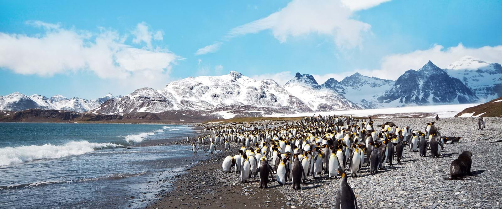
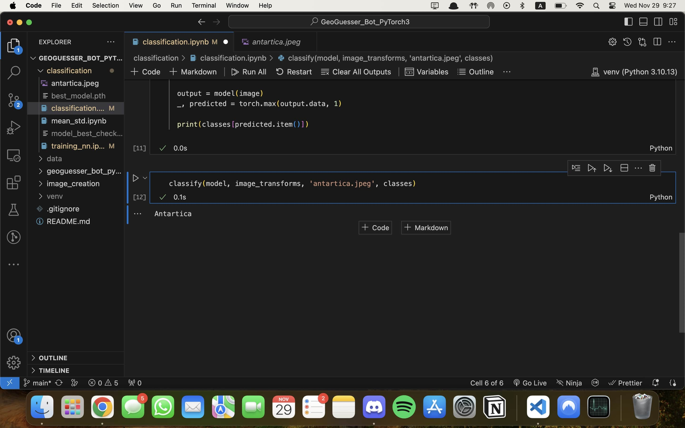

# GeoGuesser_Bot_PyTorch

## About
<p>Due to the technically consumption heavy nature of ML training I made this work only for contintents as i didnt have access to a gpu as well as I didnt have access to very large data sets. I truly enjoyed expirementing with pyTorch and am quite happy with the results, read the instructions below if youd like to try (may have some issues here and there because i reorgenized some files)</p>

## Sample Images


*Image of Continent 1*


*Image of Continent 2*

<p>
  RUN PROCESS:

Create virtual enviorement :  (pytorch only works on pyton3.10 rn i think)

      $python3.10 -m venv venv   

Run virtual Enviorment : 

      $source venv/bin/activate     

</p>
<p>
  Install all the imports as needed and orgenize your data like so
  (you can use the python image_creation folder to get images but use at your own risks)
  
  ```
  - data
    -training
      - country1_images
        - image1.jpg
        - image2.jpg
        - xxx.jpg
        -...
      - country2_images
        - image1.jpg
        - image2.jpg
        - ...
   -validation
      - country1_images
        - image3.jpg
        - image4.jpg
        - xxx.jpg
        -...
      - country2_images
        - image5.jpg
        - image6.jpg
        - ...
  ```

</p>
<p>
  Adjust the epoch numbers for a more accurate NN but note the obvious longer training time. If possible it is reccomended to adjust the code to use the GPU when selecting the device
</p>

<p>After you are done training the model (may take a while) you can insert an image. I left two images in the classificaion folder that you can use to test if it worked or not</p>

### SideNote:
<p>Because I am new to git I ended up accidentally loading in the models i created and tried to push with them. They were too large of files and I ended up somehow messing the entire git file up. That is why this project doesnt have many git commits.</p>

